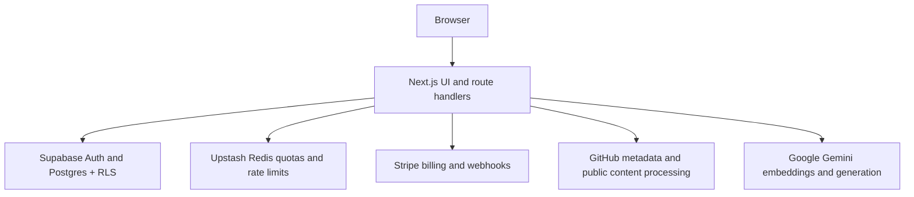

# Dandi AI

**Production-oriented AI developer platform for repository intelligence, RAG workflows, API access, usage controls, and subscription billing.**

[](https://github.com/Lifelimit/Cursor-Course---Dandi-AI/actions/workflows/ci.yml)

**Live app:** [dandi-orcin.vercel.app](https://dandi-orcin.vercel.app) · **Repository:** [Lifelimit/Cursor-Course---Dandi-AI](https://github.com/Lifelimit/Cursor-Course---Dandi-AI)

*Personal engineering project — feature-complete for its current scope. Not a commercial launch or course exercise.*

## Overview

Dandi AI is a production-oriented developer platform that combines GitHub repository intelligence, retrieval-based questioning, API access management, usage monitoring, and subscription billing in one authenticated workspace.

Dandi explores how repository intelligence, retrieval-augmented generation, authenticated API access, usage controls, and subscription management can be combined into one maintainable AI product. The intended user is a developer who needs to understand unfamiliar public repositories, test API integrations safely, and operate usage and billing from a single dashboard.

The project was built to demonstrate full-stack AI application engineering end to end: auth boundaries, quota enforcement, billing reconciliation, ingestion pipelines, and a product UI that treats loading, error, and partial-data states as real workflows.

## Product capabilities

Verified capabilities in the current codebase:

- **Public repository summarization** — README-grounded overview plus GitHub metadata via `/api/github-summarizer`
- **Repository preparation for retrieval** — public-repository indexing and durable job restore via `/api/rag/ingest`
- **Source-grounded repository questions** — streamed answers with optional source evidence via `/api/rag/chat`
- **API key lifecycle** — create, edit, revoke, replace, mask, validate, and per-key limits
- **Usage visibility** — workspace and per-key analytics, alert thresholds, CSV export
- **Plan and quota enforcement** — Hobby, Premium, and Researcher plans with Redis-backed atomic reservations
- **Stripe subscription management** — checkout, billing portal, invoices, payment methods, webhook reconciliation
- **GitHub App connection visibility** — verified installation metadata in Account Settings (display-only for repository reads)
- **Signed webhook test delivery** — authenticated on-demand test sends with SSRF-resistant destination validation
- **Account and session management** — Supabase Auth with email, password, magic link, and Google sign-in

## Architecture



At a high level:

| Layer | Responsibility |
| --- | --- |
| **Next.js App Router** | UI, layouts, and `app/api/*` route handlers |
| **Supabase** | Auth, Postgres, Row-Level Security, vector storage for embeddings |
| **Service-role server paths** | Trusted writes that bypass RLS after session verification |
| **Upstash Redis** | Hot usage counters, atomic quota reservations, rate limits |
| **Stripe** | Subscriptions, invoices, payment methods, signed webhook events |
| **GitHub** | Public repository metadata, README/content fetch, App installation metadata |
| **Google Gemini** | Embeddings (`gemini-embedding-001`) and generation via Vercel AI SDK |
| **Vercel** | Production deployment |

Trust boundaries are documented in [`docs/ARCHITECTURE.md`](docs/ARCHITECTURE.md), [`docs/ARCHITECTURE_BOUNDARIES.md`](docs/ARCHITECTURE_BOUNDARIES.md), and [`docs/decisions/`](docs/decisions/).

## Security and trust boundaries

Concrete protections verified in the repository:

- **Supabase RLS** on user-owned tables; browser clients use scoped public keys only
- **Three client tiers** — browser, authenticated server session, and server-only service-role
- **API key hashing** with HMAC; plaintext keys shown once at creation and masked afterward
- **Atomic quota reservations** in Redis Lua before billable repository work; fail-closed on Redis outages
- **Rate limiting** on sensitive endpoints, including webhook tests and GitHub metadata
- **CORS and same-origin checks** for browser-initiated API access via `ALLOWED_API_ORIGINS`
- **Content Security Policy** with per-request nonces in production; no `unsafe-inline` scripts
- **Safe error handling** — no secret, prompt, or repository-content leakage in responses
- **Stripe webhook verification** with signature checks and entitlement reconciliation
- **SSRF-resistant webhook testing** — DNS, redirect, and private-IP protections on outbound test delivery
- **Public-repository-only intelligence** — Summary, Prepare, and Ask require a public visibility probe; GitHub App connection state is display-only and does not authorize private reads

See [`docs/SECURITY_RLS_CHECKLIST.md`](docs/SECURITY_RLS_CHECKLIST.md) and [`docs/SECURITY_REVIEW_GUIDE.md`](docs/SECURITY_REVIEW_GUIDE.md).

## Reliability and validation

Local and CI validation scripts (from `package.json`):

```bash
yarn migrations:check   # Supabase migration lineage
yarn lint               # ESLint
yarn typecheck          # Next typegen + tsc
yarn test               # Node regression tests
yarn build              # Production build
yarn ci:check           # migrations + lint + typecheck + test + build
```

GitHub Actions CI (`.github/workflows/ci.yml`) also runs `yarn audit --groups dependencies --level high` before `yarn ci:check`.

There is no browser end-to-end test suite. External integration probes are available separately:

```bash
yarn external:readiness          # redacted env readiness report
yarn external:readiness --probe  # optional live read-only probes when configured
```

## Key engineering decisions

| Decision | Rationale |
| --- | --- |
| Public repositories only for intelligence | Keeps authorization and data-retention scope bounded; GitHub App data stays display-only |
| Service-role writes behind session checks | User-scoped reads use RLS; trusted mutations use server-only admin clients |
| Atomic Redis quota reservations | Prevents concurrent overage and fails closed when Redis is unavailable |
| Deferred automatic webhook delivery | Scheduled customer-event delivery requires a scheduler plan beyond current personal scope |
| No fabricated legal pages | Privacy/Terms copy does not exist in-repo; placeholder legal text would be misleading |
| CSP nonce hardening | Production scripts use request nonces instead of global `unsafe-inline` allowance |
| Personal-project scope | Feature set is complete for portfolio demonstration, not commercial launch |

Decision records: [`docs/decisions/README.md`](docs/decisions/README.md)

## Current limitations

Deliberate scope boundaries:

- Repository intelligence focuses on **public GitHub repositories** only
- A connected GitHub App shows verified installation metadata but **does not grant private repository intelligence**
- **Automatic customer-event webhook delivery**, retries, and persisted delivery history are intentionally deferred; on-demand signed test delivery remains available
- **Email delivery** requires external SMTP configuration (for example Resend) and live validation; it is not verified in CI
- **Legal documentation** is not included because approved legal text does not exist
- Dandi is primarily a **personal engineering and portfolio project**, not a commercially launched SaaS

## Local development

### Prerequisites

- Node.js **24.x** (see `package.json` `engines`)
- Yarn **1.22.x**
- A Supabase project with migrations applied
- Stripe test-mode keys for billing flows
- Upstash Redis for quotas and rate limits
- Google Generative AI API key(s) for embeddings and generation

### Setup

```bash
git clone https://github.com/Lifelimit/Cursor-Course---Dandi-AI.git
cd Cursor-Course---Dandi-AI
yarn install
cp .env.example .env.local
```

Fill in `.env.local` using `.env.example` as the reference. Required groups:

| Group | Required for |
| --- | --- |
| Supabase URL, anon key, service role | Auth, database, RLS-backed reads, trusted writes |
| `NEXT_PUBLIC_APP_URL` | Canonical app origin |
| `API_KEY_HMAC_SECRET` | API key hashing (generate with `openssl rand -hex 32`) |
| Stripe secret, webhook secret, publishable key, price IDs | Billing and checkout |
| Upstash Redis URL and token | Quotas and rate limits |
| `GOOGLE_API_KEYS` | Embeddings and generation |

Optional integrations:

- `GITHUB_TOKEN` — retries for rate-limited public metadata checks
- GitHub App variables — Account Settings installation flow ([setup guide](docs/GITHUB_APP_LIVE_SETUP.md))
- SMTP variables — application email alerts (all five must be set together)
- `ALLOWED_API_ORIGINS` — browser API access (defaults to local dev origin)

CI and local `yarn ci:check` use mock values from `scripts/validate.sh`; they do not require live external services.

### Database

Apply migrations from `supabase/migrations/` to your Supabase project before using dashboard, billing, usage, or RAG flows.

### Run and validate

```bash
yarn dev          # http://localhost:3000
yarn lint
yarn typecheck
yarn test
yarn ci:check     # full local CI gate
```

Before pushing to GitHub, run `yarn lint` and `yarn typecheck` at minimum.

## Main routes

| Route | Purpose |
| --- | --- |
| `/dashboards` | Workspace overview and recent repository activity |
| `/playground` | GitHub summarization and RAG testing |
| `/usage` | Usage analytics and quota health |
| `/billing` | Plans, invoices, and payment methods |
| `/account` | Workspace settings, including profile, GitHub, API access, webhooks, and security |
| `/docs` | In-app API documentation |

## Repository structure

| Path | Purpose |
| --- | --- |
| `app/` | App Router pages, layouts, and API route handlers |
| `components/` | UI grouped by product area (`dashboard`, `billing`, `playground`, `usage`, `auth`, `ui`) |
| `lib/` | Server utilities, services, billing, security, Redis, and AI/RAG orchestration |
| `hooks/` | Client React hooks |
| `scripts/` | Validation and maintenance scripts |
| `supabase/migrations/` | Postgres schema, RLS policies, and vector storage |
| `tests/` | Node regression tests |
| `docs/` | Architecture, security guardrails, and decision records |

Domain map for targeted exploration: [`docs/DOMAIN_MAP.md`](docs/DOMAIN_MAP.md)

## Deployment

Dandi deploys to **Vercel**. Set production environment variables to match `.env.example`, apply Supabase migrations to the production database, and configure Stripe webhook endpoints to point at `/api/webhooks/stripe`.

**Production URL:** [https://dandi-orcin.vercel.app](https://dandi-orcin.vercel.app)

Do not commit `.env.local` or any file containing live secrets.

## Tech stack

Verified from `package.json`:

| Area | Technology |
| --- | --- |
| Framework | Next.js **16.2.10** (App Router) |
| UI | React **19.2.7**, Tailwind CSS **4** |
| Language | TypeScript **5** |
| Auth and database | Supabase Auth, Postgres, RLS |
| Billing | Stripe **22.x** |
| Counters and limits | Upstash Redis, `@upstash/ratelimit` |
| AI | Vercel AI SDK, `@ai-sdk/google`, Google Gemini embeddings and generation |
| Runtime | Node **24.x**, Yarn **1.22.x** |

## Project status

Dandi is considered **feature-complete for its current personal-project scope**. Future work would be driven by real users, a commercial launch decision, or a clearly defined new product requirement.

Agent and contributor guardrails live in [`AGENTS.md`](AGENTS.md) and [`docs/PROJECT_RULES.md`](docs/PROJECT_RULES.md).
