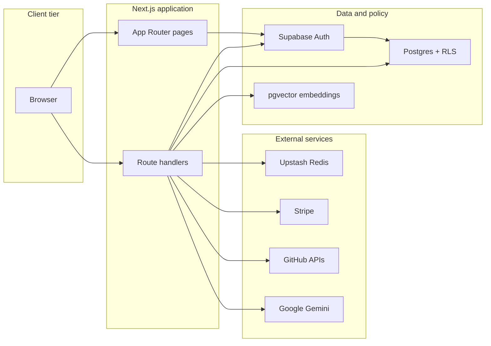

# Dandi Architecture

Dandi is a production-oriented Next.js developer platform for authenticated AI API access, usage monitoring, billing, and public-repository intelligence.

For portfolio readers, start with the root [`README.md`](../README.md) for screenshots, setup, and limitations. This document summarizes system shape and trust boundaries.

## System flow

```text
Browser
  ↓
Next.js UI and API routes (app/)
  ├─ Supabase Auth + Postgres + RLS
  ├─ Service-role trusted writes (server-only)
  ├─ Upstash Redis quotas and rate limits
  ├─ Stripe billing and webhook reconciliation
  ├─ GitHub public metadata and content processing
  └─ Google Gemini embeddings, ingestion, and RAG chat
```



## Application shape

- `app/` — App Router pages, layouts, route handlers, auth callback, hidden `/protected` validation route
- `components/` — UI grouped by product area
- `hooks/` — client hooks
- `lib/` — shared server/client utilities, services, billing, security, Redis, AI/RAG orchestration
- `supabase/` — config, migrations, snippets, seed data
- `tests/` — Node regression tests
- `scripts/` — validation helpers
- `docs/` — guardrails and decision records

See [`DOMAIN_MAP.md`](DOMAIN_MAP.md) for a compact routing map.

## Product areas

- Landing page with pricing and account-aware calls to action
- Supabase signup, login, account, and protected dashboard flows
- API key lifecycle management
- Usage analytics, quotas, alert thresholds, and alert channels
- Stripe checkout, subscriptions, billing portal, invoices, payment methods, and webhooks
- GitHub public repository metadata, summarization, ingestion, embeddings, and RAG chat
- Playground for key validation, repository analysis, and network inspection
- GitHub App installation metadata in Account Settings (display-only for repository reads)

## Main routes

| Route | Purpose |
| --- | --- |
| `/` | Landing page |
| `/signup`, `/login` | Authentication |
| `/dashboards` | Workspace overview and recent repository activity |
| `/playground` | GitHub summarization and RAG testing |
| `/usage` | Usage analytics and quota health |
| `/billing` | Plans, invoices, and payment methods |
| `/account` | Profile, GitHub, API access, webhooks, and security |
| `/docs` | In-app API documentation |
| `/protected` | Hidden auth-gated API key validation route |

## Trust boundaries

### Supabase clients

- Browser code uses only public, scoped Supabase clients.
- Server user flows use the session-aware server client.
- `supabaseAdmin` and service-role keys stay server-only for trusted operations that intentionally bypass RLS.

### Repository intelligence

- Summary, Prepare, and Ask require a public-visibility probe.
- GitHub App installation records are display-only and do not authorize private repository reads.
- Sensitive filenames are excluded from ingestion.

### Usage and billing

- Quota enforcement uses atomic Redis reservations before billable repository work.
- Redis outages fail closed for quota-enforced paths.
- Stripe webhooks are verified server-side; user-initiated billing routes are separate from provider-signed events.

### Webhooks

- Account settings support endpoint configuration, signing-secret lifecycle, and authenticated on-demand test delivery.
- Automatic customer-event delivery, retries, and delivery history are deferred. See [`decisions/2026-07-12-webhook-production-delivery-deferred.md`](decisions/2026-07-12-webhook-production-delivery-deferred.md).

## Security model

- Supabase Auth identifies users.
- Supabase RLS enforces account and user data boundaries independently from UI checks.
- Route handlers validate inputs at trust boundaries.
- Production CSP uses per-request nonces. See [`decisions/2026-07-12-csp-nonce-hardening.md`](decisions/2026-07-12-csp-nonce-hardening.md).

Related docs:

- [`ARCHITECTURE_BOUNDARIES.md`](ARCHITECTURE_BOUNDARIES.md)
- [`SECURITY_RLS_CHECKLIST.md`](SECURITY_RLS_CHECKLIST.md)
- [`ROUTE_HANDLER_RULES.md`](ROUTE_HANDLER_RULES.md)
- [`AI_RAG_GUARDRAILS.md`](AI_RAG_GUARDRAILS.md)

## Validation model

Use the narrowest command that meaningfully validates a change:

| Command | Scope |
| --- | --- |
| `yarn lint` | ESLint |
| `yarn typecheck` | TypeScript |
| `yarn test` | Node regression tests |
| `yarn migrations:check` | Migration lineage |
| `yarn build` | Production build |
| `yarn ci:check` | Full local CI gate |
| `yarn external:readiness` | Optional external integration readiness |

Before pushing, run at least `yarn lint` and `yarn typecheck`.
